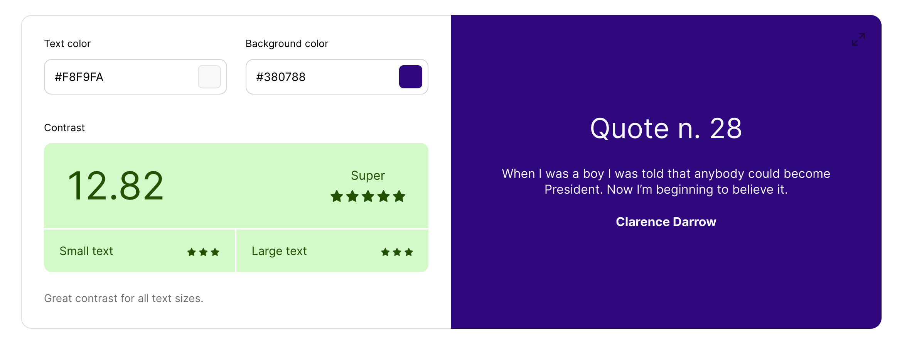
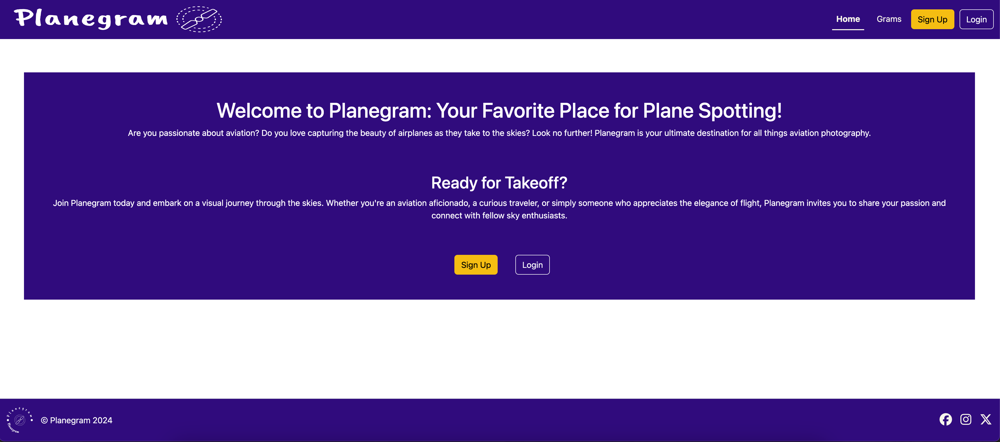
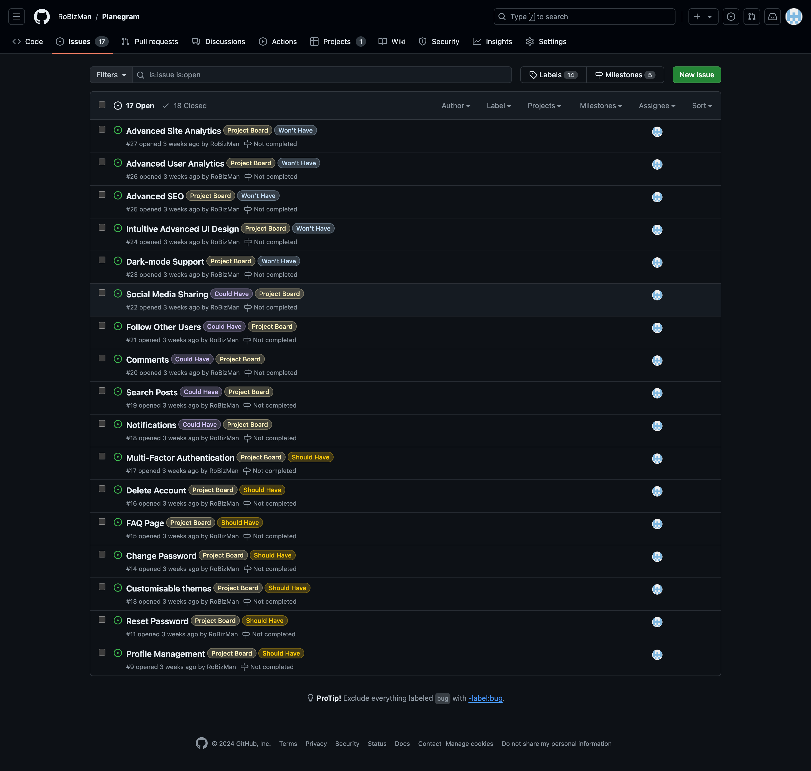

# [PLANEGRAM](https://planegram-ef1046dc025e.herokuapp.com)

[](https://github.com/RoBizMan/Planegram/commits/main)
[](https://github.com/RoBizMan/Planegram/commits/main)
[](https://github.com/RoBizMan/Planegram)

---

## Introduction

Welcome to Planegram: The Ultimate Hub for Aviation Enthusiasts! If you have a passion for aviation and a love for capturing the beauty of aeroplanes as they soar through the skies, you’ve landed in the right place. Planegram is your premier destination for all things related to aviation photography.

The primary goal of Planegram is to create a vibrant, user-friendly platform that connects aviation enthusiasts and photographers worldwide. By showcasing stunning imagery and providing valuable resources, Planegram aims to inspire a community of individuals who share a love for flight and the art of capturing it.

## Target Audience

Planegram is designed for a diverse audience, including aviation fans, aspiring photographers, and curious travellers. Whether you are a seasoned photographer looking to refine your skills or a newcomer eager to learn about aviation photography, Planegram welcomes you to share your passion and connect with fellow sky enthusiasts. The platform is also ideal for those who appreciate the elegance of flight and want to explore the world of aviation through photography.

## Value Proposition

At Planegram, users can enjoy a streamlined experience focused on aviation photography. The website features a collection of stunning aeroplane images, each accompanied by captions that include the plane's make and model, the name of the photographer, and the number of likes received. This simple yet engaging format allows users to appreciate the artistry of aviation photography while connecting with a community of fellow enthusiasts. 

Join Planegram today and embark on a visual journey through the skies, capturing the essence of flight and discovering the joy of aviation photography together!


source: [amiresponsive](https://ui.dev/amiresponsive?url=https://planegram-ef1046dc025e.herokuapp.com)

---

## UX

In this project, I follow the Five Planes of User Experience model invented by Jesse James Garrett.

### Five Planes of User Experience

This model aids in transforming from abstract ideas, such as creating objectives of the project and identifying the user needs, to concrete concepts, such as assembling visual elements together to produce the visual design of the idea to meet the project's objectives and users' needs.

#### The Strategy Plane
The vision for Planegram is to be a unique, visually engaging platform where aviation enthusiasts and photographers can share and appreciate stunning images of aeroplanes. Unlike other platforms, Planegram focuses on building a visually appealing and engaging space for aviation lovers to showcase their passion through photography with minimal complexity.

##### Business Goals:
•	Community Engagement: Foster a community of aviation enthusiasts who actively share their aviation photos and engage by liking the images of others. We value your input and aim to shape Planegram based on your needs and preferences.
•	Content Creation: Foster a dynamic and engaging feed, continuously enriched by high-quality aviation images uploaded by our users.
•	Brand Identity: The go-to platform for aviation photography, renowned for its intuitive, user-friendly interface and captivating visual content.

##### User Needs:
•	Aviation Enthusiasts and Photographers: A visually driven platform that allows them to upload and share aviation photos with others who share their passion.
•	Casual Users: A simple, easy-to-use platform where they can browse beautiful images of planes and engage with the content by liking their favourites.
•	Simplicity Seekers: Users prefer a straightforward experience without the complexity of comments, advanced search, or additional features like monetisation.
In this simplified context, the core value of Planegram lies in providing a streamlined experience focused on visual content and community engagement through photo sharing and likes.

#### Scope Plane

Based on the main objective and goals set out in the Strategy Plane, these requirements for developing the website are broken down into two categories:

##### Functional Requirements:
•	User Accounts and Profiles: Users should be able to create an account, set up a basic profile, and upload their aviation photos.
•	Image Upload and Sharing: A simple process for users to upload their images, add essential captions (e.g., plane make and model), and share them on the platform.
•	Like Feature: Users should be able to like photos, with the total number of likes displayed alongside the image.
•	Feed Display: A visual feed displaying photos in a grid format, similar to Instagram, where users can scroll through images of planes shared by the community.
•	Primary Navigation: Users should be able to navigate between their profile, the main photo feed, and liked images.

##### Content Requirements:
•	Aviation Photo Gallery: A visually organised gallery showcasing user-uploaded photos, with each image displaying the plane's make and model, the photographer’s name, and the number of likes.
•	User Profiles: Basic profiles showing the user's uploaded photos, a brief bio, and their total number of likes received.
•	Curated Content: A selection of standout photos or featured users could be highlighted to encourage higher engagement and showcase quality content.

#### The Structure Plane

The requirements outlined in the Scope Plane were then used to create a structure for the website. A site map below shows how users can navigate the website easily.

"Image here"

#### The Skeleton Plane

Please refer to the [Wireframes](#Wireframes) section for more detailed wireframing.

#### The Surface Plane

[Click here to view the live site.](https://planegram-ef1046dc025e.herokuapp.com)

### Colour Scheme

I used [Color Hunt](https://colorhunt.co/palette/f8f9fa380788ffc106212529#justCreated) to generate my colour palette.


- `#F8F9FA` used for primary background and text colour.
- `#380788` used for primary navbar, container, and footer colour.
- `#FFC106` used for secondary button and highlight links colour.
- `#212529` used for secondary text.

The colour palette represents a plane soaring above the night sky during a red-eye flight. However, the colour palette needed to pass the minimum colour contrast set by the Web Content Accessibility Guide (WCAG). The colour palette was tested using [Coolors' Color Contrast Checker](https://coolors.co/contrast-checker/). The result below shows that these colours passed the minimum WCAG contrast ratio.

<details>
<summary>Color Contrast Checker</summary>



</details>

<br>

### Typography

- [Bootstrap's native font stack](https://getbootstrap.com/docs/5.3/content/reboot/#native-font-stack) was used throughout the site.

- [Font Awesome](https://fontawesome.com) icons were used throughout the site, such as the social media icons in the footer and buttons in a detailed gram view.

---

## User Stories

### New Site Users

- As a new site user, I would like to create an account, so that I can start sharing my aviation photos with the Planegram community.
- As a new site user, I would like to upload my first aviation photo, so that I can contribute to the platform and share my passion for airplanes.
- As a new site user, I would like to browse the photo feed, so that I can see aviation photos uploaded by others and enjoy the community's content.
- As a new site user, I would like to like photos, so that I can engage with the content that resonates with me.
- As a new site user, I would like to see the number of likes on each photo, so that I can gauge which images are popular in the community.

### Returning Site Users

- As a returning site user, I would like to upload new aviation photos, so that I can continue contributing to the Planegram community.
- As a returning site user, I would like to browse the latest photos on the platform, so that I can keep up with new content from other aviation enthusiasts.
- As a returning site user, I would like to like additional photos, so that I can continue engaging with the content that I enjoy.
- As a returning site user, I would like to edit the captions or details of my previously uploaded photos, so that I can update or improve the information shared with the community.
- As a returning site user, I would like to delete my previously uploaded photos, so that I can remove any content that no longer represents my best work or that I no longer want to share.

### Site Admin

- As a site administrator, I should be able to monitor reports submitted by users, so that I can address any incorrect information or inappropriate content on the platform.
- As a site administrator, I should be able to remove or correct any reported photos, so that the platform maintains accurate and appropriate content.
- As a site administrator, I should be able to monitor the overall content quality, so that I can ensure the platform aligns with the community's standards and values.

---

## Wireframes

To follow best practice, wireframes were developed for mobile, tablet, and desktop sizes.
I've used [Balsamiq](https://balsamiq.com/wireframes) to design my site wireframes.

### Mobile Wireframes

<details>
<summary> Click here to see the Mobile Wireframes </summary>

Home
- 

Sign Up
- 

Login
- 

Sign Out
- 

Upload
- 

Edit
- 

Report
- 

Grams
- 

Detailed Gram
- 

</details>

### Tablet Wireframes

<details>
<summary> Click here to see the Tablet Wireframes </summary>

Home
- 

Sign Up
- 

Login
- 

Sign Out
- 

Upload
- 

Edit
- 

Report
- 

Grams
- 

Detailed Gram
- 

</details>

### Desktop Wireframes

<details>
<summary> Click here to see the Desktop Wireframes </summary>

Home
- 

Sign Up
- 

Login
- 

Sign Out
- 

Upload
- 

Edit
- 

Report
- 

Grams
- 

Detailed Gram
- 

</details>

---

## Features

### Existing Features

- **The Home Page**

    - The Home Page is the first contact users will encounter when visiting this website. The page appears with the title welcoming users to the website. Also, there are two buttons that leads users either to the Sign Up page or the Login page. The Home Page will be hidden and automatically redirect logged users to the Grams page once logged in. [Click here to view the home page](https://planegram-ef1046dc025e.herokuapp.com)



- **Header**

    - At the top of the website is the header, where users can see the company's logo on the left and the fixed navigation menu on the right side, which was made to be fully responsive across different device sizes. In addition, the navigation menu is hidden on a mobile device, and the hamburger icon allows users to open and close the navigation menu. Also, the Upload link is hidden when a user is not logged in. The Upload link will appear, the Home link will hide, and the Sign Up and Login buttons will be replaced with the Sign Out button once a user is logged in. These features will return to the original once a user is logged out.


- **Footer**

    - The footer is at the bottom of the website, where users can visit the company's social media presence. The copyright message is located beside the company's logo.


- **The Alert Message**

    - The alert message appears below the navigation bar to inform a user of their action, such as successfully logging in or logging out and updating their post successfully.


- **The Grams page**

    - The Grams page consists of three columns and two rows of posts of a plane image with a caption and who was photographed by. If there are more than six posts, the load more button will appear, and a user will click the load more button to load more posts. In the tablet view, the number of columns will be reduced to two and the number of rows will be increased to three. Again, the number of rows will increase to six, and the number of columns will be reduced to one in the mobile view. [Click here to view the home page](https://planegram-ef1046dc025e.herokuapp.com/grams/)


- **The detailed gram page**

    - The detailed gram page will display a main plane photo with the following details: caption, photographer, date the photo was taken, and name of the plane make and model. It also features a count of likes and multiple buttons: Like, Edit, Delete, and Report. These buttons are hidden when a user is not logged in, but the “Login” button will replace these buttons. Once a user is logged in, they can modify or delete their own posts, but they cannot modify or delete posts that are not theirs. Also, a user cannot report their own posts. They can only report someone’s posts for incorrect details. [Click here to view the home page](https://planegram-ef1046dc025e.herokuapp.com/grams/1/)


- **The delete post confirmation**

    - The detailed gram page has a feature that prevents a user from accidentally deleting their own post. When a user clicks the delete button, the modal message will display and ask the user to confirm the deletion.


- **The Upload page**

    - The Upload page allows users to upload pictures of their planes with captions, photographers, the date a photo was taken, and the name of the plane make and model.


- **The Edit page**

    - The Edit page allows users to modify their posts to update the details or change a plane image. The edit form is prepopulated with the existing details saved in the database.


### Future Features

- Profile Management to allow users to edit their personal details,change their password or delete their account.
- Reset Password to allow users to reset their password if they forget their password.
- Customisable themes for users to change the theme to their own preferred style.
- Implement MFA (Multi-Factor Authentication) to secure their accounts from potential security breaches by bad hack players.
- Introduce Notifications to receive a notification about new likes or status of reported posts.
- Enable search function by using plane make and models to find relevant posts.
- Add the comment function to allow Planegram users to comment or reply on posts.
- Enable Follow Other Users to keep an eye on new posts.
- Introduce Social Media Sharing for users to share posts to different social media sites to attract visitors to this site and convert visitors into new users.
- Implement dark-mode support to reduce eye strains on users.
- Redesign the website to include some intuitive advanced UI design.

---

## Tools & Technologies Used

- [](https://tim.2bn.dev/markdown-builder) used to generate README and TESTING templates.
- [](https://git-scm.com) used for version control. (`git add`, `git commit`, `git push`)
- [](https://github.com) used for secure online code storage.
- [](https://gitpod.io) used as a cloud-based IDE for development.
- [](https://en.wikipedia.org/wiki/HTML) used for the main site content.
- [](https://en.wikipedia.org/wiki/CSS) used for the main site design and layout.
- [](https://www.javascript.com) used for user interaction on the site.
- [](https://www.python.org) used as the back-end programming language.
- [](https://www.heroku.com) used for hosting the deployed back-end site.
- [](https://getbootstrap.com) used as the front-end CSS framework for modern responsiveness and pre-built components.
- [](https://www.djangoproject.com) used as the Python framework for the site.
- [](https://www.postgresql.org) used as the relational database management.
- [](https://dbs.ci-dbs.net) used as the Postgres database from Code Institute.
- [](https://cloudinary.com) used for online static file storage.
- [](https://whitenoise.readthedocs.io) used for serving static files with Heroku.
- [](https://balsamiq.com/wireframes) used for creating wireframes.
- [](https://fontawesome.com) used for the icons.
- [](https://chat.openai.com) used to help debug, troubleshoot, and explain things.
- [Perplexity AI](https://www.perplexity.ai/) used to help explain things, troubleshoot, and debug.
- [CodePen](https://codepen.io/) used for toying and testing with CSS design before committing changes to the actual website design.

---

## Database Design

Entity Relationship Diagrams (ERD) help to visualise database architecture before creating models.
Understanding the relationships between different tables can save time later in the project.

```python
class Aircraft(models.Model):
    plane_make = models.CharField(max_length=40)
    plane_model = models.CharField(max_length=40)
```

```python
class Gram(models.Model):
    caption = models.CharField(max_length=50, unique=True)
    image = CloudinaryField('image', default='placeholder')
    plane = models.ForeignKey(Aircraft, on_delete=models.CASCADE)
    date_photographed = models.DateField()
    photographer = models.ForeignKey(User, on_delete=models.CASCADE, related_name="gram_posts")
    love = models.ManyToManyField(User, related_name="loved_grams", blank=True)
    created_on = models.DateTimeField(auto_now_add=True)
```

```python
DECISION = ((0, "Awaiting"), (1, "Accepted"), (2, "Rejected"))

class Report(models.Model):
    gram = models.ForeignKey(Gram, on_delete=models.CASCADE)
    user = models.ForeignKey(User, on_delete=models.CASCADE)
    message = models.CharField(max_length=300)
    decision = models.IntegerField(choices=DECISION, default=0)
    date_reported = models.DateTimeField(auto_now_add=True)
```

I have used `pygraphviz` and `django-extensions` to auto-generate an ERD.

The steps taken were as follows:
- In the terminal: `sudo apt update`
- then: `sudo apt-get install python3-dev graphviz libgraphviz-dev pkg-config`
- then type `Y` to proceed
- then: `pip3 install django-extensions pygraphviz`
- in my `settings.py` file, I added the following to my `INSTALLED_APPS`:
```python
INSTALLED_APPS = [
    ...
    'django_extensions',
    ...
]
```
- back in the terminal: `python3 manage.py graph_models -a -o erd.png`
- dragged the new `erd.png` file into my `documentation/` folder
- removed `'django_extensions',` from my `INSTALLED_APPS`
- finally, in the terminal: `pip3 uninstall django-extensions pygraphviz -y`


source: [medium.com](https://medium.com/@yathomasi1/1-using-django-extensions-to-visualize-the-database-diagram-in-django-application-c5fa7e710e16)

---

## Agile Development Process

### GitHub Projects

[GitHub Projects](https://github.com/RoBizMan/Planegram/projects) served as an Agile tool for this project.
It isn't a specialized tool, but with the right tags and project creation/issue assignments, it can be made to work.

Through it, user stories, issues, and milestone tasks were planned, then tracked on a weekly basis using the basic Kanban board.


### GitHub Issues

[GitHub Issues](https://github.com/RoBizMan/Planegram/issues) served as an another Agile tool.
There, I used my own **User Story Template** to manage user stories.




It also helped with [Milestone](https://github.com/RoBizMan/Planegram/milestones) iterations on a weekly basis.


### MoSCoW Prioritisation

I've decomposed my Epics into stories prior to prioritizing and implementing them.
Using this approach, I was able to apply the [MoSCoW prioritisation](https://github.com/users/RoBizMan/projects/3/views/7) and labels to my user stories within the Projects tab.

- **Must Have**: guaranteed to be delivered (*max 60% of stories*)
- **Should Have**: adds significant value, but not vital (*the rest ~20% of stories*)
- **Could Have**: has small impact if left out (*20% of stories*)
- **Won't Have**: not a priority for this iteration


Furthermore, based on MoSCoW prioritisation, I calculated the story points based on the [Estimation Matrix](https://www.7pace.com/wp-content/uploads/2022/08/01_Image_Estimation-Matrix-1-scaled.jpg) to score each MoSCoW prioritisation based on my knowledge and skiils and the requirements of the project.


Finally, I assigned each MoSCoW prioritisation into one of four sprint weeks.


---

## Testing

> [!NOTE]  
> For all testing, please refer to the [TESTING.md](TESTING.md) file.

---

## Deployment

The live deployed application can be found deployed on [Heroku](https://planegram-ef1046dc025e.herokuapp.com).

### PostgreSQL Database

This project uses a [Code Institute PostgreSQL Database](https://dbs.ci-dbs.net).

To obtain my own Postgres Database from Code Institute, I followed these steps:

- Signed-in to the CI LMS using my email address.
- An email was sent to me with my new Postgres Database.

> [!CAUTION]  
> - PostgreSQL databases by Code Institute are only available to CI Students.
> - You must acquire your own PostgreSQL database through some other method
> if you plan to clone/fork this repository.
> - Code Institute students are allowed a maximum of 8 databases.
> - Databases are subject to deletion after 18 months.

### Cloudinary API

This project uses the [Cloudinary API](https://cloudinary.com) to store media assets online, due to the fact that Heroku doesn't persist this type of data.

To obtain your own Cloudinary API key, create an account and log in.

- For *Primary interest*, you can choose *Programmable Media for image and video API*.
- Optional: *edit your assigned cloud name to something more memorable*.
- On your Cloudinary Dashboard, you can copy your **API Environment Variable**.
- Be sure to remove the `CLOUDINARY_URL=` as part of the API **value**; this is the **key**.

### Heroku Deployment

This project uses [Heroku](https://www.heroku.com), a platform as a service (PaaS) that enables developers to build, run, and operate applications entirely in the cloud.

Deployment steps are as follows, after account setup:

- Select **New** in the top-right corner of your Heroku Dashboard, and select **Create new app** from the dropdown menu.
- Your app name must be unique, and then choose a region closest to you (EU or USA), and finally, select **Create App**.
- From the new app **Settings**, click **Reveal Config Vars**, and set your environment variables.

> [!IMPORTANT]  
> This is a sample only; you would replace the values with your own if cloning/forking my repository.

| Key | Value |
| --- | --- |
| `CLOUDINARY_URL` | user's own value |
| `DATABASE_URL` | user's own value |
| `DISABLE_COLLECTSTATIC` | 1 (*this is temporary, and can be removed for the final deployment*) |
| `SECRET_KEY` | user's own value |

Heroku needs three additional files in order to deploy properly.

- requirements.txt
- Procfile
- runtime.txt

You can install this project's **requirements** (where applicable) using:

- `pip3 install -r requirements.txt`

If you have your own packages that have been installed, then the requirements file needs updated using:

- `pip3 freeze --local > requirements.txt`

The **Procfile** can be created with the following command:

- `echo web: gunicorn app_name.wsgi > Procfile`
- *replace **app_name** with the name of your primary Django app name; the folder where settings.py is located*

The **runtime.txt** file needs to know which Python version you're using:
1. type: `python3 --version` in the terminal.
2. in the **runtime.txt** file, add your Python version:
	- `python-3.9.19`

For Heroku deployment, follow these steps to connect your own GitHub repository to the newly created app:

Either:

- Select **Automatic Deployment** from the Heroku app.

Or:

- In the Terminal/CLI, connect to Heroku using this command: `heroku login -i`
- Set the remote for Heroku: `heroku git:remote -a app_name` (replace *app_name* with your app name)
- After performing the standard Git `add`, `commit`, and `push` to GitHub, you can now type:
	- `git push heroku main`

The project should now be connected and deployed to Heroku!

### Local Deployment

This project can be cloned or forked in order to make a local copy on your own system.

For either method, you will need to install any applicable packages found within the *requirements.txt* file.

- `pip3 install -r requirements.txt`.

You will need to create a new file called `env.py` at the root-level,
and include the same environment variables listed above from the Heroku deployment steps.

> [!IMPORTANT]  
> This is a sample only; you would replace the values with your own if cloning/forking my repository.

Sample `env.py` file:

```python
import os

os.environ.setdefault("CLOUDINARY_URL", "user's own value")
os.environ.setdefault("DATABASE_URL", "user's own value")
os.environ.setdefault("SECRET_KEY", "user's own value")

# local environment only (do not include these in production/deployment!)
os.environ.setdefault("DEBUG", "True")
```

Once the project is cloned or forked, in order to run it locally, you'll need to follow these steps:

- Start the Django app: `python3 manage.py runserver`
- Stop the app once it's loaded: `CTRL+C` or `⌘+C` (Mac)
- Make any necessary migrations: `python3 manage.py makemigrations`
- Migrate the data to the database: `python3 manage.py migrate`
- Create a superuser: `python3 manage.py createsuperuser`
- Load fixtures (if applicable): `python3 manage.py loaddata file-name.json` (repeat for each file)
- Everything should be ready now, so run the Django app again: `python3 manage.py runserver`

#### Cloning

You can clone the repository by following these steps:

1. Go to the [GitHub repository](https://github.com/RoBizMan/Planegram) 
2. Locate the Code button above the list of files and click it 
3. Select if you prefer to clone using HTTPS, SSH, or GitHub CLI and click the copy button to copy the URL to your clipboard
4. Open Git Bash or Terminal
5. Change the current working directory to the one where you want the cloned directory
6. In your IDE Terminal, type the following command to clone my repository:
	- `git clone https://github.com/RoBizMan/Planegram.git`
7. Press Enter to create your local clone.

Alternatively, if using Gitpod, you can click below to create your own workspace using this repository.

[](https://gitpod.io/#https://github.com/RoBizMan/Planegram)

Please note that in order to directly open the project in Gitpod, you need to have the browser extension installed.
A tutorial on how to do that can be found [here](https://www.gitpod.io/docs/configure/user-settings/browser-extension).

#### Forking

By forking the GitHub Repository, we make a copy of the original repository on our GitHub account to view and/or make changes without affecting the original owner's repository.
You can fork this repository by using the following steps:

1. Log in to GitHub and locate the [GitHub Repository](https://github.com/RoBizMan/Planegram)
2. At the top of the Repository (not top of page) just above the "Settings" Button on the menu, locate the "Fork" Button.
3. Once clicked, you should now have a copy of the original repository in your own GitHub account!

### Local VS Deployment

There was no difference between local and deployment noticed.

---

