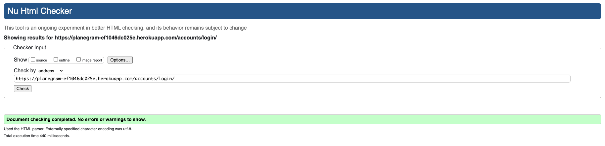
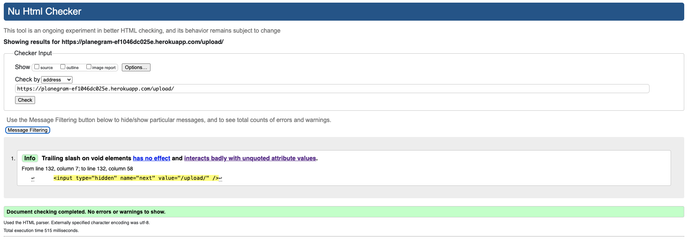

# Testing

> [!NOTE]  
> Return back to the [README.md](README.md) file.

## Code Validation

### HTML

I have used the recommended [HTML W3C Validator](https://validator.w3.org) to validate all of my HTML files.

| Page | Screenshot | Notes |
| --- | --- | --- |
| Home |  | Pass: No error found |
| Login |  | Pass: No error found |
| Sign Up |  | 4 errors |
| Sign Out |  | Pass: No error found |
| Grams |  | Pass: No error found |
| Detailed Gram |  | Pass: No error found |
| Edit Gram |  | Pass: No error found |
| Like/Unlike Gram |  | Pass: No error found |
| Upload |  | Pass: No error found |
| Report |  | Pass: No error found |
| Error 404 |  | Pass: No error found |
| Error 500 |  | Pass: No error found |

### CSS

I have used the recommended [CSS Jigsaw Validator](https://jigsaw.w3.org/css-validator) to validate all of my CSS files.

| Directory | File | Screenshot | Notes |
| --- | --- | --- | --- |
| static | style.css |  | Pass: No error found |

### JavaScript

I have used the recommended [JShint Validator](https://jshint.com) to validate all of my JS files.

| Directory | File | Screenshot | Notes |
| --- | --- | --- | --- |
| static | script.js |  | All clear, no errors found |

### Python

I have used the recommended [PEP8 CI Python Linter](https://pep8ci.herokuapp.com) to validate all of my Python files.

| Directory | File | Screenshot | Notes |
| --- | --- | --- | --- |
| blog | models.py |  | All clear, no errors found |
| blog | urls.py |  | All clear, no errors found |
| blog | views.py |  | All clear, no errors found |
| grams | forms.py |  | All clear, no errors found |
| grams | urls.py |  | All clear, no errors found |
| grams | views.py |  | All clear, no errors found |
| planegram | urls.py |  | All clear, no errors found |
| planegram | views.py |  | All clear, no errors found |
| upload | forms.py |  | All clear, no errors found |
| upload | urls.py |  | All clear, no errors found |
| upload | views.py |  | All clear, no errors found |